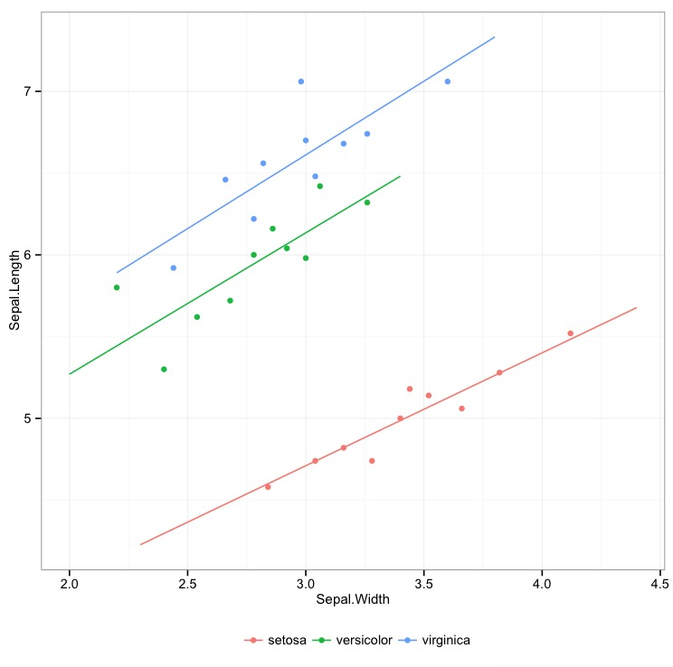

## stat_binmean

`stat_binmean()` is a `stat` for ggplot2. It returns the mean of `y` and `x` within bins of `x`. It's a bareborne version of the Stata command [binscatter](https://github.com/michaelstepner/binscatter)

```R
ggplot(iris, aes(x = Sepal.Width , y = Sepal.Length)) + stat_binmean()
```


```R
ggplot(iris, aes(x = Sepal.Width , y = Sepal.Length, color = Species)) + stat_binmean(n=10) 
```


Since `stat_binmean` is just a layer for ggplo2, you can surimpose any model fit 

```R
ggplot(iris, aes(x = Sepal.Width , y = Sepal.Length, color = Species)) + stat_binmean(n=10) + stat_smooth(method = "lm", se = FALSE)
```



