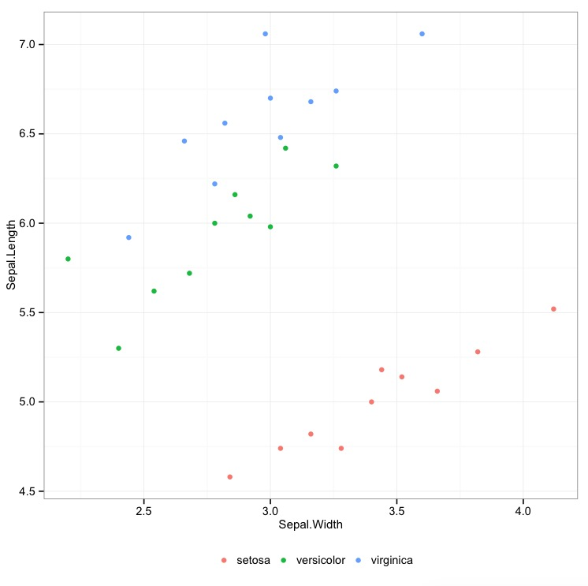

# Vector functions
The package adds the following vector functions

````R
# sample_mode returns the statistical mode
sample_mode(c(1, 2, 2))
sample_mode(c(1, 2))
sample_mode(c(NA, NA, 1))
sample_mode(c(NA, NA, 1), na.rm = TRUE)

# bin creates integer variable for quantile categories (corresponds to Stata xtile)
v <- c(NA, 1:10)                   
bin(v, n_quantiles = 3) # 3 groups based on terciles
bin(v, probs = c(0.3, 0.7)) # 3 groups based on two quantiles
bin(v, cutpoints = c(2, 3)) # 3 groups based on two cutpoints

# winsorize (default based on 5 x interquartile range)
v <- c(1:4, 99)
winsorize(v)
winsorize(v, replace = NA)
winsorize(v, probs = c(0.01, 0.99))
winsorize(v, cutpoints = c(1, 50))

# demean on multiple groups (ie multiple fixed effects)
demean(c(1,2), fe = c(1,1))  
demean(c(NA,2), fe = list(c(1,2), c(1,3)))               
demean(c(1,2), fe = list(c(NA,2), c(1,3)))
````

# data.table functions
The package adds the following verbs for data.tables

````R
#setkeep keeps certain columns inplace
DT <- data.table(
  id = c(1,2),
  v1 = c(1,1),
  v2 = c(2,1)
)
setkeep(DT, list(id, v2))
setkeep(DT, -id)
````


## Exploration

````R
# sum_up prints detailed summary statistics (corresponds to Stata summarize)
N <- 100
DT <- data.table(
  id = 1:N,
  v1 = sample(5, N, TRUE),
  v2 = sample(1e6, N, TRUE)
)
sum_up(DT)
sum_up(DT, v2, d = TRUE)
sum_up(DT, starts_with("v"), by = v1)

# duplicates returns duplicated rows
DT <- data.table(a = rep(1:2, each = 3), b = 1:6)
duplicates(DT, by = a)
duplicates(DT, by = list(a,b))
````

### Visual exploration

`graph` is a wrapper for `ggplot2` functionalities, useful for interactive exploration of datasets

````R
N <- 10000
DT <- data.table(
  id = sample(c("id1","id2","id3"), N, TRUE),
  v1 = sample(c(1:5), N, TRUE),
  v2 = rnorm(N, sd = 20),
  v3 = sample(runif(100, max=100), N, TRUE)
)
DT[, v4 := (id=="id1")* v2 + rnorm(N, sd = 5)]
graph(DT)
````


````R
graph(DT, by = id)
````


````R
graph(DT, by = id, type = "boxplot")
````


````R
graph(DT, list(v3, v4), along_with = v2)
````


````R
graph(DT, list(v3, v4), along_with = v2, by = id, type = "loess")
````


## Join
`join` is a wrapper for data.table merge functionalities.

- The option "type" specifies the type of join based on SQL syntax. Possible types are : left, right, inner, outer, semi, anti and cross.
- The option "check" checks there are no duplicates in the master or using data.tables (as in Stata).
- The option "gen" specifies the name of a new variable that identifies non matched and matched rows (as in Stata).
- The option "inplace" specifies whether the dataset x should be merged in place. It is only available for left joins, when y has no duplicates (for now).

````R
x <- data.table(a = rep(1:2, each = 3), b = 1:6)
y <- data.table(a = 0:1, bb = 10:11)
# outer corresponds to Stata joinby keep(master matched using)
join(x, y, type = "outer")
# left corresponds to Stata joinby keep(master matched)
join(x, y, type = "left")
# right corresponds to Stata joinby keep(mached using)
join(x, y, type = "right")
# inner corresponds to Stata joinby keep(matched)
join(x, y, type = "inner")

join(x, y, type = "semi")
join(x, y, type = "anti")
join(x, y, type = "outer", check = 1~m)
join(x, y, type = "outer", gen = "_merge")
join(x, y, type = "left", check = m~1, inplace = TRUE)
````

## Panel Data
The package adds support for panel data
````R
# elapsed dates
library(lubridate)
date <- mdy(c("04/03/1992", "01/04/1992", "03/15/1992"))  
datem <- as.monthly(date)
# display as a period
datem
as.weekly(date)
as.quarterly(date)
# behaves as an integer for numerical operations:
datem + 1
# behaves as a date for period extractions:
year(datem)
week(datem)

# lag/lead create lag/lead variables (corresponds to Stata L. F.)
year <- c(1992, 1989, 1991)
value <- c(4.1, 4.5, 3.3)
lag(value, 1, order_by = year) # returns value in previous year, like  dplyr::lag
lag(value, 1, along_with = year) #  returns value in year - 1
library(lubridate)
date <- mdy(c("04/03/1992", "01/04/1992", "03/15/1992"))
datem <- as.monthly(date)
value <- c(4.1, 4.5, 3.3, 5.3)
lag(value, along_with = datem) 

# fill_gap fills in gaps in a data.table time variable (corresponds to Stata tsfill)
DT <- data.table(
    id    = c(1, 1, 1, 2, 2),
    year  = c(1992, 1989, 1991, 1992, 1991),
    value = c(4.1, 4.5, 3.3, 3.2, 5.2)
)
fill_gap(DT, value, along_with = year, by = id)
library(lubridate)
DT[, date:= mdy(c("03/01/1992", "04/03/1992", "07/15/1992", "08/21/1992", "10/03/1992"))]
DT[, datem :=  as.monthly(date)]
fill_gap(DT, value, along_with = datem, by = id)

# setna fills in missing values along a time variable
DT <- data.table(
 id    = c(1, 1, 1, 1, 2, 2),
 date  = c(1992, 1989, 1991, 1993, 1992, 1991),
 value = c(NA, NA, 3, NA, 3.2, 5.2)
)
DT1 <- copy(DT)
setkey(DT1, id, date)
DT2 <- copy(DT1)
DT3 <- copy(DT1)
setna(DT, value, along_with = date, by = id)
setna(DT1)
setna(DT2, value, rollends = TRUE)
setna(DT3, value, roll = "nearest")
````

# Others
This package also adds
- A data.table method for the generic `tidyr::spread` that relies on `dcast.data.table` (much faster).
- `floor_date`, originally from the package `lubridate`, now accepts "quarter" as an argument 
- `tempname` returns a character that corresponds to a name not assigned in the environment (or list, or character vector) specified by the first variable.

````R
tempname(c("temp1", "temp3"), 4)
tempname(globalenv())
tempname(data.frame(temp = 1), n = 3)
````


# Syntax
Functions with the prefix `set` modify the input data.table in place.
Function selects variables similarly to `dplyr` syntax. Each function has a version that accepts strings, formulas or quoted expressions : its name is the original function's name with the suffix _ (see the [dplyr vignette](https://github.com/hadley/dplyr/blob/master/vignettes/nse.Rmd) for more details). For instance, the SE version of `sum_up` is `sum_up_`.


````R
# NSE version
sum_up(DT, list(v2, v3), by = list(id,v1))
# SE version
sum_up_(DT, c("v2","v3"), by = c("id","v1"))
````
